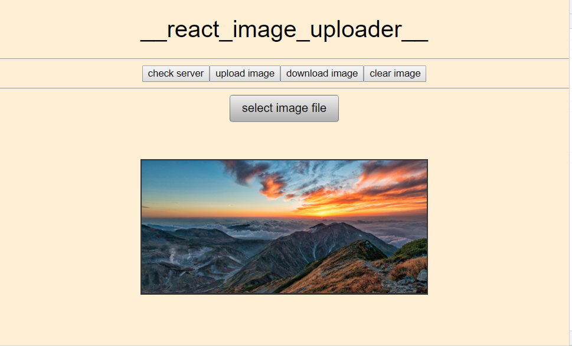

# Image Uploader

**Purpose**: User can upload image files which will be converted to Base64 DataURL's which can be stored and retrieved from the node server. A progress bar component utilizes the Progress Event to visually represent the state of the data transfer. The user can also toggle fullscreen view by clicking on the image. 

**Utilities**: [XMLHTTPRequest Object](https://developer.mozilla.org/en-US/docs/Web/API/XMLHttpRequest), [FileReader Object](https://developer.mozilla.org/en-US/docs/Web/API/FileReader)

**Commands**: install react scripts: `npm i`; run dev server: `npm start`; run node server: `node server/index.js`

